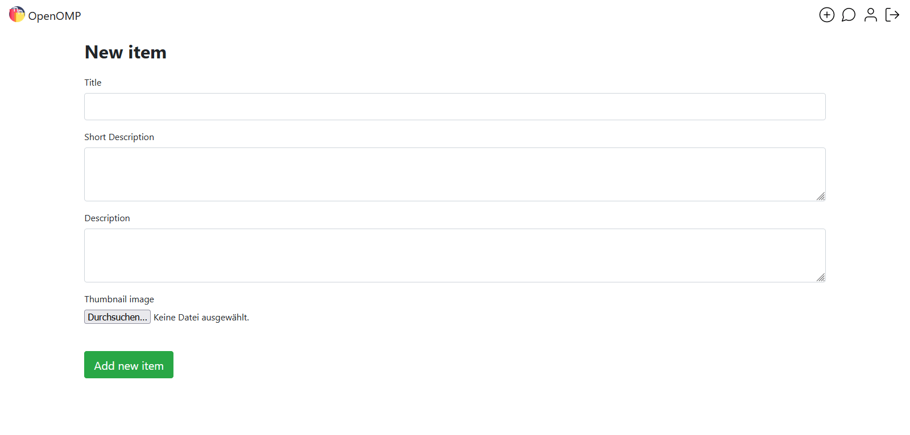

# OpenOMP
OpenOMP is an open-source online market platform that can be used to quickly create niche online markets. 

Niche markets are usually organized through specialized forums. Having a dedicated platform for a niche market helps the market to grow by making it more accessible than searching through obscure forums.

## Getting started
You can try out OpenOMP live here:

https://heroku.com

To test out the platform locally, download the whole project, install all the python dependencies using the requirements.txt file and run the app.py module. At least Python 3.8 needs to be installed to run the web app.

## Create your own online market
You can modify the existing codebase to fit your niche market. The platform is build with the web-framework flask and is well known by many developers. This way its easy to find people to help you create your own platform.

Because of its small size, the platform can be hosted on heroku at no cost.

## Features

### Messaging sellers
Through the messaging system users can connect with sellers. its possible to message sellers directly though their item pages.

### Explore sellers
The homepage displays all the latest items that have been added by users of this platform.

### Users accounts  
Users can create their own accounts with using a username and a password.

### Becoming a seller
Every user can sell their items by creating a new item page. 

